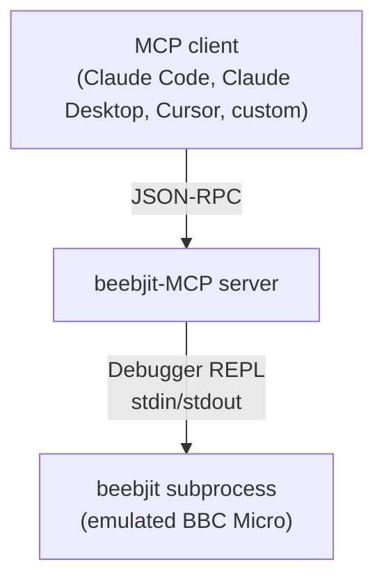
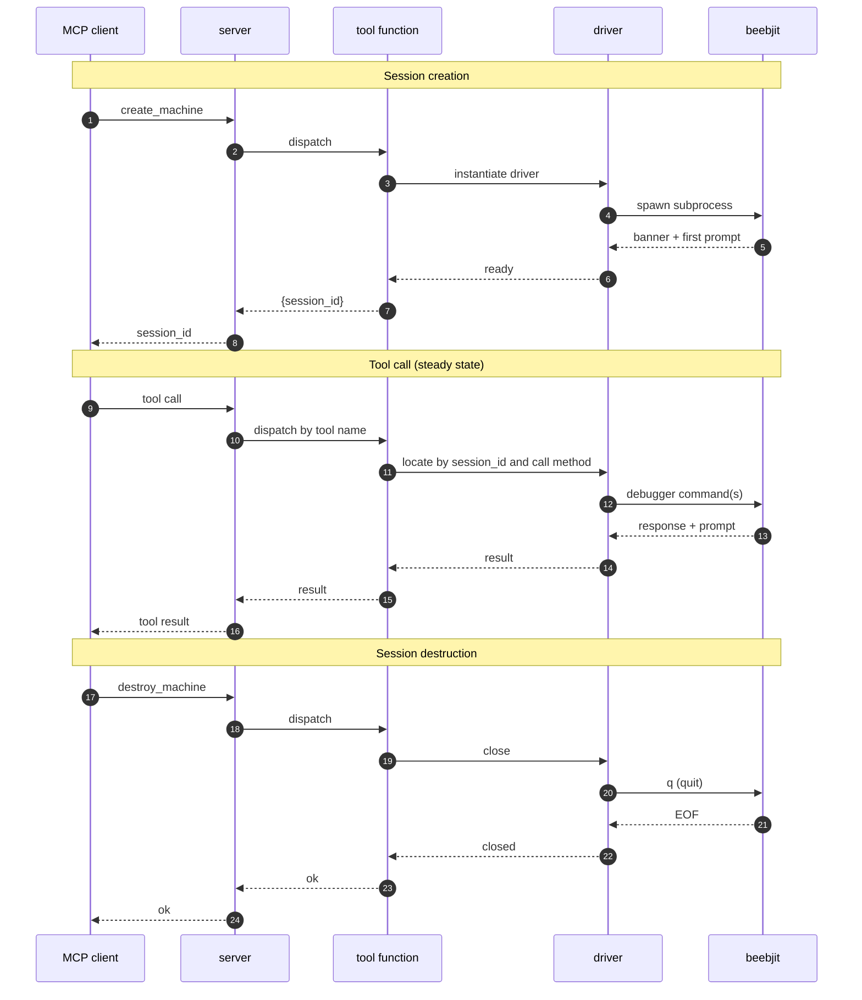
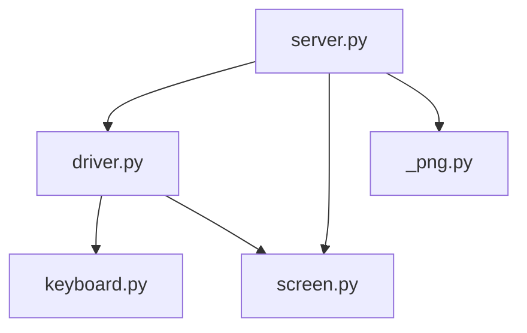

# Architecture

As a [Model Context Protocol](https://modelcontextprotocol.io) (MCP) [server](https://modelcontextprotocol.io/specification/draft/server), beebjit-MCP exposes [beebjit](https://github.com/scarybeasts/beebjit), a cycle-accurate BBC Micro emulator, to MCP-capable [clients](https://modelcontextprotocol.io/specification/draft/architecture) such as Claude Desktop, Claude Code, and Cursor. Through it, an AI agent can drive a live BBC Micro: type at it, run BASIC, read memory and registers, capture screen text.

The abstraction the server provides is a set of [MCP tools](https://modelcontextprotocol.io/specification/draft/server/tools) (`create_machine`, `type_input`, `read_memory`, and so on) layered over the interactive debugger that beebjit exposes on its standard streams. Each [tool call](https://modelcontextprotocol.io/specification/draft/server/tools#calling-tools) translates into a short sequence of debugger commands that the server writes and reassembles. The agent never sees the debugger prompt, beebjit never sees JSON.

Each beebjit subprocess holds one BBC Micro's worth of state, so concurrent sessions are fully independent. Running multiple machines in parallel is a matter of spawning more subprocesses and keeping a dict of them.

## Layers

The beebjit-MCP server is organised into three layers:

- The MCP client that communicates with the server using JSON-RPC.

- The server, which exposes the tools for the MCP client to call and orchestrates the actual interaction between the client and a `beebjit` instance via its debugger REPL interface using:
  - **driver** for the actual interfacing with beebjit
  - **keyboard** mapping of host keys to BBC key events
  - **screen** decoding screen framebuffers
  - **_png** stdlib encoder for packaging screenshots as PNG

- **`beebjit` subprocess**, a complete emulated BBC Micro with its own 6502, MOS, and BBC BASIC.

Each [beebjit-MCP tool](tool-reference.md) call runs synchronously, driving beebjit through one or more REPL debugger commands and returning on completion of the command sequence.

## Request flow

A typical MCP client request flow starts with the client creating a session that wraps a beebjit subprocess. The session is opened by `create_machine`, which spawns the subprocess and returns a UUID. The client then invokes any number of beebjit-MCP tools against that UUID, each dispatched by the server to the driver and translated into debugger commands sent to beebjit. When done, the client calls `destroy_machine`, and the subprocess is terminated.

**Session creation**

1. Client invokes [`create_machine`](tool-reference.md#create_machine) via JSON-RPC.

1. Server routes the call to the registered tool function.

1. The tool function instantiates the driver.

1. The driver spawns the beebjit subprocess. The launch flags are described under [Behaviours](#behaviours).

1. beebjit emits its banner output and the debugger prompt. The driver blocks for up to ten seconds waiting for this first prompt.

1. Control returns to the tool function once the prompt is seen.

1. The tool function generates a UUID, stores the driver in the session dictionary, and returns it.

1. Server serialises the JSON-RPC reply containing the session UUID.

**Session established**

9. Client invokes a [beebjit-MCP tool](tool-reference.md) by name, passing the `session_id` and any parameters.

1. Server routes the call to the registered tool function for that tool.

1. The tool function looks up the driver in the session dictionary and calls the appropriate method. This is the only step that distinguishes one session from another.

1. The driver writes one or more debugger commands to beebjit's stdin. `runCycles` for example sends a register read followed by a breakpoint-armed continuation.

1. beebjit replies on stdout, terminating with the debugger prompt.

1. The driver parses the response.

1. The tool function returns the result.

1. Server serialises the JSON-RPC reply.

**Session destruction**

17. Client invokes [`destroy_machine`](tool-reference.md#destroy_machine) with the session UUID.

1. Server routes the call to the registered tool function.

1. The tool function pops the driver from the session dictionary and calls close.

1. The driver writes the `q` quit command to beebjit's stdin and waits five seconds for clean exit. If the subprocess is wedged, the driver escalates to `SIGKILL`. See [session-lifecycle.md](session-lifecycle.md) for the full teardown sequence.

1. beebjit closes its stdout pipe on exit.

1. The driver reaps the subprocess.

1. The tool function returns ok.

1. Server serialises the JSON-RPC reply.

## Modules

The beebjit-MCP consists of four primary modules, each with a distinct responsibility. Imports flow downward only.

| Module | Description |
| --- | --- |
| `server.py` | <ul><li>Registers the MCP tools and routes incoming JSON-RPC calls to the right driver.</li><li>Holds the session dictionary mapping each `session_id` to its driver.</li><li>Performs binary discovery on startup, see [binary-discovery.md](binary-discovery.md).</li><li>The full MCP tool API is documented in [tool-reference.md](tool-reference.md).</li></ul> |
| `driver.py` | <ul><li>Owns the lifecycle of one beebjit subprocess and is the only module that talks to it.</li><li>Every MCP tool maps to a driver method. All communication with beebjit goes through `sendCommand`, the primitive that writes a debugger command and reads its response.</li><li>Coordinates with `keyboard.py` for translating host key input and `screen.py` for decoding MODE 7 framebuffers.</li><li>For the API of MCP tools that drive it, see [tool-reference.md](tool-reference.md).</li></ul> |
| `keyboard.py` | <ul><li>A pure lookup module translating host key input into BBC key events.</li><li>Exposes `asciiToKeys` (assumes CAPS LOCK on, the cold-boot default) and `asciiToKeysRaw` (CAPS LOCK off, uses SHIFT for uppercase).</li><li>Returns `(bbc_key_code, shifted)` pairs that the driver enacts as `keyDown` and `keyUp` events around a HOLD and GAP timing window.</li><li>Per-character mapping and timing rationale in [keypress-timing.md](keypress-timing.md).</li></ul> |
| `screen.py` | <ul><li>A pure decoder for the BBC's screen framebuffer.</li><li>Currently only MODE 7 is supported.<ul><li>`decodeMode7` produces an array of 25 strings of 40 characters from the 1024-byte teletext page.</li><li>`rotateMode7Page` reorders the page into display order before decoding when the BBC has scrolled, since MODE 7 scrolling moves the CRTC start-address pointer rather than copying memory.</li><li>Decoded text is consumed by [`read_mode7_text`](tool-reference.md#read_mode7_text).</li><li>Teletext control codes and scroll handling in [mode7-decode.md](mode7-decode.md).</li></ul></li></ul> |
| `_png.py` | <ul><li>A pure stdlib encoder converting BGRA pixel data into PNG bytes.</li><li>Single public function `bgraToPng(bgra, width, height) -> bytes`, used by [`screenshot`](tool-reference.md#screenshot) to package beebjit's rendered framebuffer.</li><li>Implementation uses `zlib` for deflate compression and CRC32 plus `struct` for the PNG chunk headers, with no third-party dependency.</li><li>The leading underscore signals "implementation detail; do not import from outside the package", so a future swap to a different encoder stays a one-module change.</li></ul> |

## Design considerations

Two classes of decisions apply to every tool.

### Constraints

These are properties of the system that are deliberately invariant. They constrain what tools can do.

- **One beebjit subprocess per session.**
  - No pooling, no sharing, no reuse across `destroy_machine` and `create_machine`.
  - Each session begins with a fresh process.

- **The debugger REPL is the only channel between Python and beebjit.**
  - No alternative IPC, no file watching, no shared memory, no debug socket.
  - Every fact the server knows about the BBC came back through this one stream.

- **IO and interpretation never share a module.**
  - `driver.py` owns IO.
  - `keyboard.py` and `screen.py` are pure and testable without a running emulator.

- **Tool calls are synchronous and serialised within a session.**
  - A second call cannot start until the first returns.
  - The MCP transport is request and response, the FastMCP dispatcher is single-threaded, and the driver enforces one outstanding debugger command at a time.

- **No state persists across server restarts.**
  - The session dictionary is in-memory only.
  - `session_id` UUIDs do not survive a restart. Clients that need durability rebuild it themselves.

### Behaviours

Behaviours that affect every tool, not just one of them. Documented here once rather than repeated in each section.

- **Error reporting.**
  - Anything the driver cannot complete, whether a per-command timeout, a closed pipe, or an unrecognised debugger response, raises `BeebjitError`.
  - The exception carries the most recent kilobyte of beebjit's stderr, attached at construction.
  - The client receives this as an MCP tool error with the diagnostic text intact.

- **Subprocess teardown.**
  - `destroy_machine` sends a graceful quit to beebjit and waits five seconds for the process to exit.
  - If beebjit is hung, the driver escalates to `SIGKILL` and waits unconditionally.
  - Reader threads are joined last, so a returning `destroy_machine` means the subprocess and its pipes are fully released.

- **Stdout discipline.**
  - The driver depends on beebjit's `-log-stderr` flag, which routes the emulator's diagnostic logging to stderr and leaves stdout as a clean stream of debugger output.
  - The flag is therefore set on every spawn.

- **Render configuration.**
  - Every spawn also sets `-headless-render` and `-opt video:always-render` so beebjit allocates the BGRA render buffer in headless mode and keeps it current per 50Hz frame.
  - `-headless-render` is the precondition for the `savescreen` debugger command used by [`screenshot`](tool-reference.md#screenshot).
  - `-opt video:always-render` ensures the buffer is fully painted under `-fast` rather than left in an intermediate state between frames, which would surface as torn captures or unstable `frame_buffer_crc32` polling.

- **Lifetime cap.**
  - Each beebjit subprocess is launched with a `-cycles` cap, currently one trillion BBC cycles, as the circuit-breaker against orphaned processes outliving their server.
  - If a client disconnects without calling `destroy_machine` and the server itself is killed before pipe teardown can take effect, beebjit will eventually trip the cap and exit on its own.

- **Idempotent destroy.**
  - `destroy_machine` is safe to call twice.
  - The second call returns cleanly, which keeps retrying clients from accumulating errors on a session that has already been torn down.

- **Concurrency.**
  - Each server process handles one MCP client at a time, and the FastMCP dispatcher serialises tool calls.
  - Sessions never see overlapping requests.
  - Multiple server processes on the same host are independent and share nothing.

### Implementation specifics

Two implementation choices worth flagging: the driver's concurrency model, and the live-cycle-read pattern used by `runCycles`.

- **Cycle-anchored runs.**
  - `runCycles(n)` reads beebjit's live cycle counter, computes an absolute target, arms a one-shot cycle breakpoint, and resumes execution.
  - Reading the live counter on every call avoids the drift that a server-maintained counter would accumulate from beebjit's small overshoots at each breakpoint.
  - The drift would eventually shrink `tapKey`'s HOLD window below the threshold the BBC MOS needs to recognise a key, and keypresses would be silently dropped.
  - See [keypress-timing.md](keypress-timing.md) for the thresholds and the probe data behind them.

- **Driver concurrency.**
  - The driver runs three threads.
  - The main thread drives the REPL interaction, writing each command and collecting the response.
  - Two reader threads handle beebjit's stdout and stderr, capturing the debugger output from stdout and the emulator's internal logging from stderr.
  - Both readers are daemons, so an abandoned driver does not hang Python interpreter shutdown.

## License boundary

- **The beebjit binary is never bundled** keeping separation of licenses.
  - beebjit (or any fork) is GPLv3
  - beebjit-MCP is MIT

- Discovery happens at runtime through the documented search order.

## Further reading

- [debugger-protocol.md](debugger-protocol.md), prompt framing, per-command output shapes, parser regexes, failure symptoms.

- [session-lifecycle.md](session-lifecycle.md), create and destroy sequences, error modes, concurrency.

- [keypress-timing.md](keypress-timing.md), why `tapKey` defaults are HOLD=5M and GAP=5M BBC cycles, with probe data.

- [mode7-decode.md](mode7-decode.md), teletext control codes, hardware scroll handling, framebuffer layout.

- [binary-discovery.md](binary-discovery.md), `$BEEBJIT` and `$PATH` discovery order, the working-directory contract for `roms/`.
