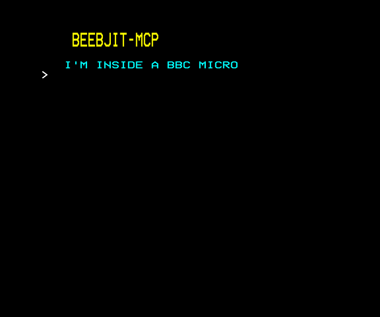

# MCP worked example

An end-to-end demo driven through the MCP tools:

1. Boot a beebjit emulator instance.

2. Wait for the standard BASIC `>` prompt.

3. Type a short BASIC program with MODE 7 text and `RUN` it.

4. Capture the displayed MODE 7 screen as both text and a PNG.

Refer to the [tool reference](tool-reference.md) for detailed information on the tools used.

## The prompt

A natural-language prompt to an MCP-speaking agent triggers the flow. Something like:

> Type and run a BASIC program with a "BEEBJIT-MCP" heading and the line "I'M INSIDE A BBC MICRO". Capture the screen as a PNG when it finishes.

The agent decomposes that into a sequence of MCP tool calls.

## The tool sequence

1. **`create_machine`** with `model="b"`. Spawns a BBC B, returns `session_id`. Every subsequent call carries that id.

2. **`run_until_text`** with `needle=">"`, default `max_cycles=20_000_000`. Runs the emulator in chunks until the MODE 7 screen contains the BASIC prompt.

3. **`type_input`** with `text="NEW\n"`. Clears any in-memory program. The trailing `\n` submits the line.

4. **`run_for_cycles`** with `cycles=1_000_000`. Gives BASIC time to return to `>`.

5. **`type_input`** with the full BASIC source as one string, lines separated by `\n`. Each character translates to a matrix key event with the right SHIFT handling for the punctuation. The BASIC source:

   ```text
   10 CLS
   20 PRINT CHR$(141)CHR$(131)"  BEEBJIT-MCP"
   30 PRINT CHR$(141)CHR$(131)"  BEEBJIT-MCP"
   40 PRINT
   50 PRINT CHR$(134)"  I'M INSIDE A BBC MICRO"
   ```

   `CHR$(141)` is double-height (printed twice, once for the top half and once for the bottom). `CHR$(131)` switches to yellow, `CHR$(134)` to cyan.

6. **`type_input`** with `text="RUN\n"`. Starts execution.

7. **`run_for_cycles`** with `cycles=15_000_000`. The budget the program has to print everything and return.

8. **`read_mode7_text`**. Decodes the MODE 7 page into 25 strings of 40 characters, returned alongside a newline-joined single string.

9. **`screenshot`**. Captures the rendered framebuffer as a base64-encoded PNG with width and height attached.

10. **`destroy_machine`** with `session_id`. Releases the beebjit subprocess.

## The rendered screen

After base64-decoding the bytes returned by `screenshot`:



## How it works

The sequence has four phases.

### Session lifecycle

`create_machine` spawns a fresh beebjit subprocess and returns a `session_id`. Every subsequent tool call carries that id to route to the same session. `destroy_machine` tears the subprocess down. Calls between the two run against the same BBC.

### Waiting for the BASIC prompt

After `create_machine`, beebjit is at cycle zero with MOS init still ahead. [`run_until_text`](tool-reference.md#run_until_text) advances the emulator in chunks and watches the MODE 7 screen for the `>` prompt. The twenty-million-cycle ceiling sits well above what any supported model needs to reach the prompt, so a `found=False` here means something is genuinely wrong.

### Typing and running the program

With the prompt visible, [`type_input`](tool-reference.md#type_input)`("NEW\n")` clears any in-memory program and a one-million-cycle [`run_for_cycles`](tool-reference.md#run_for_cycles) gives BASIC time to return to the `>` prompt. The BASIC source is then typed in one `type_input` call: each character maps to a matrix key event, including SHIFT handling for the punctuation. `type_input("RUN\n")` starts execution, and the fifteen-million-cycle settle is the budget the program has to print everything and return.

### Capturing the screen

[`read_mode7_text`](tool-reference.md#read_mode7_text) reads the teletext page in display order (see [Scroll](#scroll) below for what that means) and returns 25 strings of 40 characters together with a newline-joined single string. [`screenshot`](tool-reference.md#screenshot) does a parallel read of beebjit's rendered framebuffer and returns it as a base64-encoded PNG with width and height attached.

## Scroll

BBC MODE 7 uses hardware scroll. When the BBC needs another line below row 24, the CRTC start-address pointer at `&0350`/`&0351` is advanced rather than memory being copied. The 1024-byte page at `&7C00` still holds the data, just rotated. [`read_mode7_text`](tool-reference.md#read_mode7_text) handles this transparently: it reads the start-address pointer and rotates the page back into display order before returning, so what the caller sees matches what is on the screen. Reach for [`read_memory`](tool-reference.md#read_memory)`(addr=0x7C00, length=1000)` only to read the raw, physical-order bytes.

This worked example never scrolls because the program prints four lines total. Longer-running output does scroll, and the physical bytes diverge from what is on the screen:

```text
After seven PRINT statements onto a five-row screen:

Display order              Physical memory at &7C00
(read_mode7_text)          (read_memory)

  C                          F
  D                          G
  E                          C
  F                          D
  G                          E
```

The two newest lines (F, G) overwrote the top of the page; the older C, D, E still sit lower down. A caller that decodes raw memory reads F, G, C, D, E top to bottom, not the correct C, D, E, F, G.

## Common pitfalls

- **The BASIC prompt never arrives.** `run_until_text` returns `found=False` after `max_cycles` expires. The default is comfortable for every supported model on a normal host. Raise `max_cycles` if a heavily loaded host or a slower model occasionally times out.

- **The program never finishes.** Some BBC BASIC programs loop forever or block on input. The fifteen-million-cycle settle is generous for programs that print and return to the `>` prompt; raise it for programs that do meaningful work, or follow the program type-in with `run_until_text` watching for a known marker the program prints near the end.

- **Cycle budgets are BBC time, not wall time.** The BBC runs at a nominal 2 MHz, so one million BBC cycles is half a second on the real hardware. beebjit under the default `-fast` configuration runs much quicker than real time, but the BBC's perceived time is what governs the budget. Five seconds of BBC time (ten million cycles) is comfortable for short BASIC programs.

- **Leaving the session behind.** A session without a matching `destroy_machine` keeps its beebjit subprocess running until the client disconnects or the `-cycles` cap takes it down. In a stateless agent flow this is rarely an issue, but scripted callers should pair every `create_machine` with `destroy_machine`.

## Composition shortcut

Steps 3 through 7 (type NEW, type program, RUN, settle) are exactly what the [`run_basic`](tool-reference.md#run_basic) MCP tool wraps. For one-shot use the agent can collapse the sequence to:

1. **`create_machine`** with `model="b"`
2. **`run_basic`** with the program string
3. **`read_mode7_text`** and **`screenshot`** for the result
4. **`destroy_machine`** to release the session

The longer sequence above is shown because it walks through each primitive. `run_basic` is the everyday way to drive a BASIC program once a session is open.
