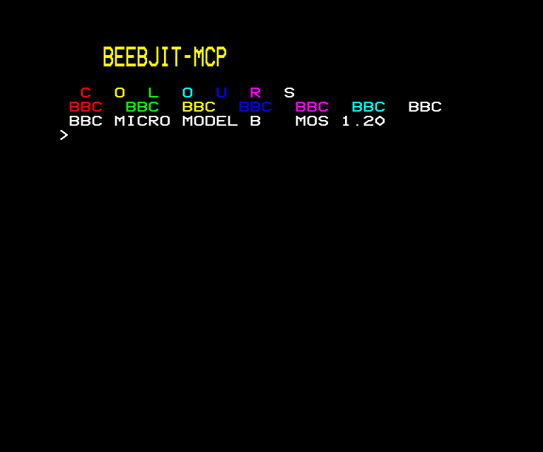

# Python library worked example

The following is a single end-to-end example that does:

1. Boots a beebjit emulator instance.

2. Loops waiting for the BASIC `>` prompt for a maximum number of cycles.

3. Types the `PROGRAM` into the emulator and `RUN`s it.

4. Captures the displayed MODE 7 screen.

Refer to the [API referrece](python-api.md) for detailed information on the methods used.

## The program

```python
from pathlib import Path

from beebjit_mcp import BeebjitDriver, BeebModel
from beebjit_mcp.screen import decodeMode7, mode7TextContains
from beebjit_mcp.image import bgraToPng


PROGRAM = (
    '10 CLS\n'
    '20 PRINT CHR$(141)CHR$(131)"  BEEBJIT-MCP"\n'
    '30 PRINT CHR$(141)CHR$(131)"  BEEBJIT-MCP"\n'
    '40 PRINT\n'
    '50 PRINT CHR$(129)" C";CHR$(131)" O";CHR$(130)" L";\n'
    '60 PRINT CHR$(134)" O";CHR$(132)" U";CHR$(133)" R";CHR$(135)" S"\n'
    '70 FOR I=1 TO 7\n'
    '80 PRINT CHR$(128+I);"BBC ";\n'
    '90 NEXT\n'
    '100 PRINT\n'
    '110 PRINT CHR$(135)"BBC MICRO MODEL B   MOS 1.20"\n'
)


def runProgramAndCapture(program: str, outputPng: Path) -> list[str]:
    """Boot a BBC, run `program`, write a PNG, return the decoded screen."""

    with BeebjitDriver.fromEnvironment(model=BeebModel.B) as bbc:

        # Poll for the BASIC `>` prompt in half-million-cycle chunks,
        # capped at twenty million so a stuck boot fails loudly rather
        # than hanging the caller.
        budget = 20_000_000
        chunk = 500_000
        while budget > 0 and not mode7TextContains(bbc.captureMode7Bytes(), ">"):
            bbc.runCycles(chunk)
            budget -= chunk
        if budget <= 0:
            raise RuntimeError("BASIC prompt did not appear within budget")

        bbc.typeText("NEW\n")
        bbc.runCycles(1_000_000)
        bbc.typeText(program)
        bbc.typeText("RUN\n")
        bbc.runCycles(15_000_000)

        rows = decodeMode7(bbc.captureMode7Bytes())

        bgra, width, height = bbc.captureScreen()
        outputPng.write_bytes(bgraToPng(bgra, width, height))

        return rows


if __name__ == "__main__":
    rows = runProgramAndCapture(PROGRAM, Path("/tmp/beebjit_demo.png"))
    for row in rows:
        print(row)

    assert "BEEBJIT-MCP" in "\n".join(rows)
```

## The rendered screen

The `bgraToPng` output, saved to `outputPng`:



## How it works

The function has four phases.

### Discovery and lifecycle

The function opens with `BeebjitDriver.fromEnvironment(model=BeebModel.B) as bbc`. [`fromEnvironment`](python-api.md#fromenvironment) runs the same discovery the MCP server uses, `$BEEBJIT` first then `beebjit` on `$PATH`. The `with` block calls `start` on entry to spawn beebjit and block until the first debugger prompt, and `close` on exit to tear the subprocess down. Both edges cover the exception path, so a `raise` inside the body still releases the subprocess.

### Polling for the BASIC prompt

Construction leaves the BBC at cycle zero with MOS init still ahead. The loop runs the emulator in half-million-cycle chunks and after each chunk checks the MODE 7 page for the BASIC `>` prompt via [`mode7TextContains`](python-api.md#mode7textcontains). The twenty-million-cycle ceiling sits well above what any supported model needs to reach the prompt, so a failure here means something is genuinely wrong, and raising rather than hanging makes that visible immediately.

### Typing and running the program

With the prompt visible, `NEW\n` clears any in-memory program and a one-million-cycle pause gives BASIC time to return to the `>` prompt. The `PROGRAM` constant is then typed verbatim: [`typeText`](python-api.md#typetext) translates each character to a keyboard matrix event with the right SHIFT handling for the punctuation in the BASIC source. `RUN\n` starts execution, and the fifteen-million-cycle settle is the budget the program has to print everything and return.

### Capturing the screen

[`captureMode7Bytes`](python-api.md#capturemode7bytes) reads the teletext page in display order. [`decodeMode7`](python-api.md#decodemode7) turns those bytes into 25 strings of 40 characters, with non-printable bytes rendered as spaces by default. [`captureScreen`](python-api.md#capturescreen) reads beebjit's rendered framebuffer in 32-bit BGRA together with its width and height, and [`bgraToPng`](python-api.md#bgratopng) packages those bytes into a PNG that any viewer understands.

## Common pitfalls

- **The BASIC prompt never arrives.** The poll loop raises `RuntimeError` after twenty million cycles. The default is comfortable for every supported model on a normal host. Raise the budget if a heavily loaded host or a slower model occasionally times out.

- **The program never finishes.** Some BBC BASIC programs loop forever or block on input. The fifteen-million-cycle settle is generous for programs that print and return to the `>` prompt; raise it for programs that do meaningful work, or replace the fixed settle with a [`mode7TextContains`](python-api.md#mode7textcontains) poll on a known marker the program prints near the end.

- **Cycle budgets are BBC time, not wall time.** The BBC runs at a nominal 2 MHz, so one million BBC cycles is half a second on the real hardware. beebjit under the default `-fast` configuration runs much quicker than real time, but the BBC's perceived time is what governs the budget. Five seconds of BBC time (ten million cycles) is comfortable for short BASIC programs.

- **Forgetting the context manager.** Without `with`, a missing or failing `close` leaves a beebjit subprocess running. The `-cycles` cap, one trillion by default, eventually takes it down, but that can be hours away.

- **Captured text out of sequence.** Once output runs past row 24, the BBC scrolls in hardware: the CRTC start-address pointer at `&0350`/`&0351` advances and the 1024-byte page at `&7C00` rotates rather than memory being copied. `captureMode7Bytes` reads the pointer and returns the page in display order. `readMemory(0x7C00, 1000)` returns physical-order bytes, which look out of sequence after any scroll. [mode7-decode.md](mode7-decode.md) has the full mechanism.
