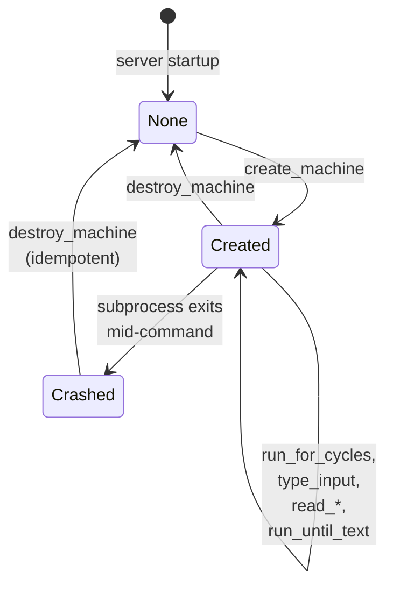
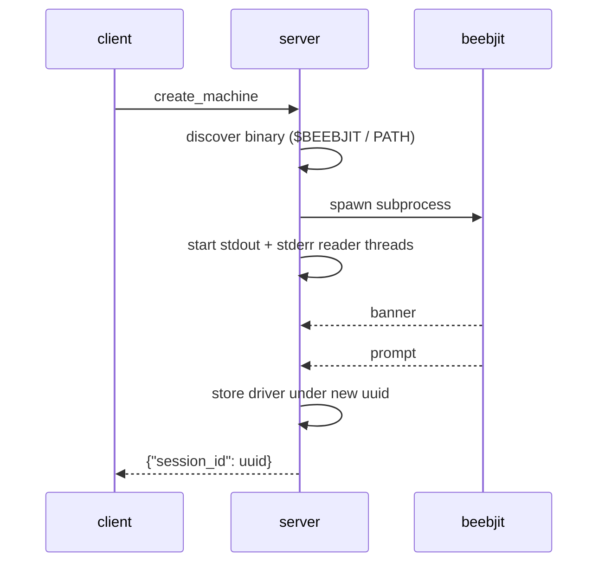
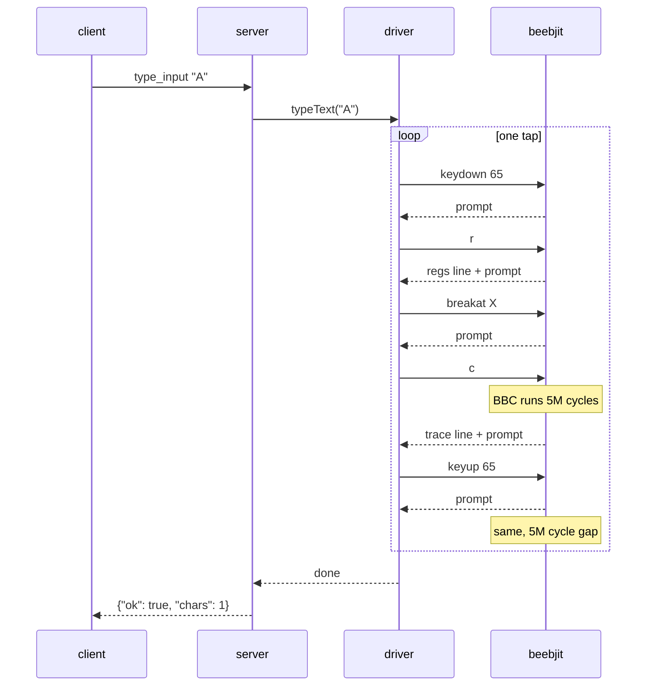
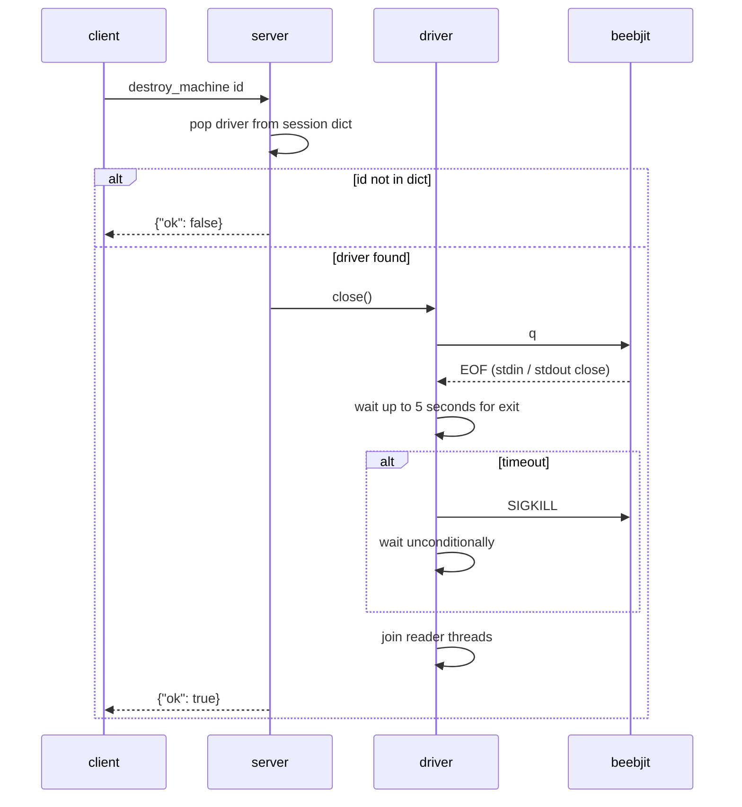

# Session lifecycle

A session represents one running BBC Micro emulator instance. The client opens a session by calling `create_machine`, which spawns a fresh beebjit subprocess and returns a UUID. The client closes it with `destroy_machine`. In between, the session is long-lived: the same subprocess handles every tool call made with that `session_id`.

The server keeps a session dictionary keyed by UUID. There is no persistence across server restarts and no shared state between concurrent sessions. Each session owns its own subprocess and its own pipes. Sessions do not interfere with each other even when multiple clients share one server process.

A session can leave the steady state in one of three ways: the client calls `destroy_machine`, the subprocess exits unexpectedly (crash, `-cycles` cap, assertion), or the client disconnects without cleanup and the session is left orphaned. Each route has a distinct recovery path.

## States

"None" means the UUID is absent from the session dictionary. It is not a stored state. `Crashed` means the dictionary still holds an entry whose underlying beebjit subprocess has exited.

## `create_machine`

The server blocks until the first `(6502db)` prompt arrives. Typical host time is under 100 ms with the fork's JIT. A 10-second internal timeout trips only on a genuinely stuck beebjit.

If `disc` is passed to `create_machine`, beebjit is spawned with `-0 <path> -autoboot`. The BBC starts running the disc's `!BOOT` file as soon as cycle zero is released, and the first prompt returns once beebjit has finished its own banner output. The client typically follows up with `run_for_cycles` to let the BBC reach a settled state before further interaction.

Initialisation stops at the first prompt. Anything past the spawn is the caller's responsibility.

## Steady state

After `create_machine` returns, the client drives the session with any combination of `run_for_cycles`, `type_input`, `read_memory`, `read_registers`, `read_mode7_text`, and `run_until_text`. Each tool call looks up the driver by `session_id` (an unknown id surfaces as an MCP tool-call error), invokes the corresponding driver method, and returns the result.

The driver handles one command at a time. `type_input("A")`, for example, expands into a fixed sequence of debugger commands that runs synchronously inside a single MCP call:

Tool calls against the same session are serialised. MCP tool calls are request and response anyway, so the serialisation matches the transport.

## `destroy_machine`

`destroy_machine` is idempotent. Calling it twice for the same id returns `{"ok": false}` the second time, which signals "already gone". Double-destroy on a retried client is safe.

On the clean path, the server sends `q`, beebjit calls `exit(0)`, stdout closes, and the driver reaps the child within 5 seconds. If beebjit does not exit in that window (for example, if it is deadlocked mid-instruction), the driver escalates to `SIGKILL` and waits unconditionally. Reader threads are joined last, so a returning `destroy_machine` means the subprocess and all its pipes are fully released.

## Error modes

### Crashed subprocess

beebjit may exit mid-command: the `-cycles` cap trips, a C-level assertion fires, or emulated BBC code wedges the emulator. The driver detects the subprocess exit and surfaces it as a tool-call error with the stderr tail attached for diagnosis.

The session dictionary still holds an entry for the dead session. `destroy_machine` cleans it out, after which a fresh `create_machine` starts over with a new subprocess.

### Stuck subprocess

beebjit stops producing output without crashing (an infinite loop in emulated BBC code, or a bare `c` with no armed stop condition). The driver's per-command timeout (5 seconds for short commands, longer for cycle-bounded runs) trips and surfaces as a tool-call error. The subprocess is still alive. The client can retry, but if the cause is in BBC code the retry will hit the same wall. The reliable recovery is `destroy_machine`, which escalates to `SIGKILL` after 5 seconds if `q` does not bring beebjit down.

### Orphaned process

The MCP client dies without calling `destroy_machine`. The server process still holds the subprocess. If the server itself exits cleanly, the subprocess's stdin pipe closes and beebjit exits when it next tries to read. If the server is SIGKILLed, beebjit processes linger until their `-cycles` cap trips (~14 host hours at default 1e12 at `-fast`) or until someone kills them manually.

The `-cycles` cap is the backstop against indefinite leakage. The server's default is large enough that the cap rarely trips during normal use.

## Capacity

A single server process can hold any number of sessions. They are independent: each owns its own subprocess and its own pipes. Memory cost is dominated by beebjit itself, roughly 30 MB RSS per subprocess. Ten concurrent sessions are on the order of 300 MB.

For details on how the server handles concurrent tool calls, see [architecture: behaviours](architecture.md#behaviours).
